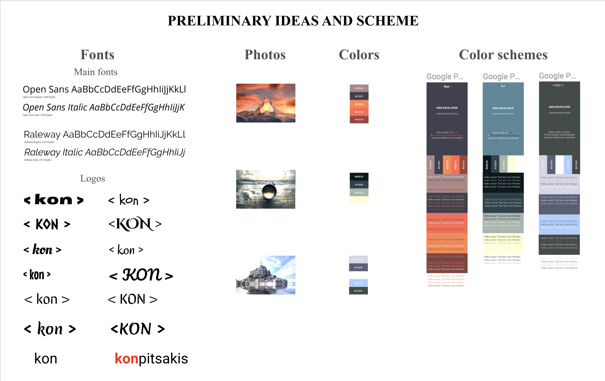
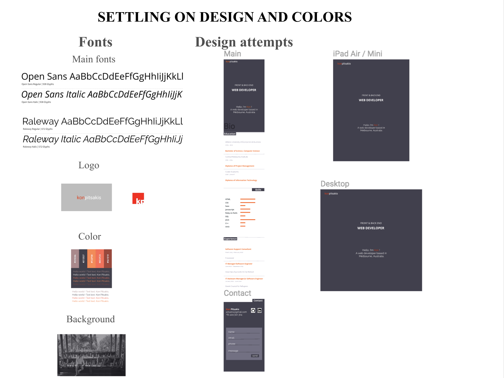
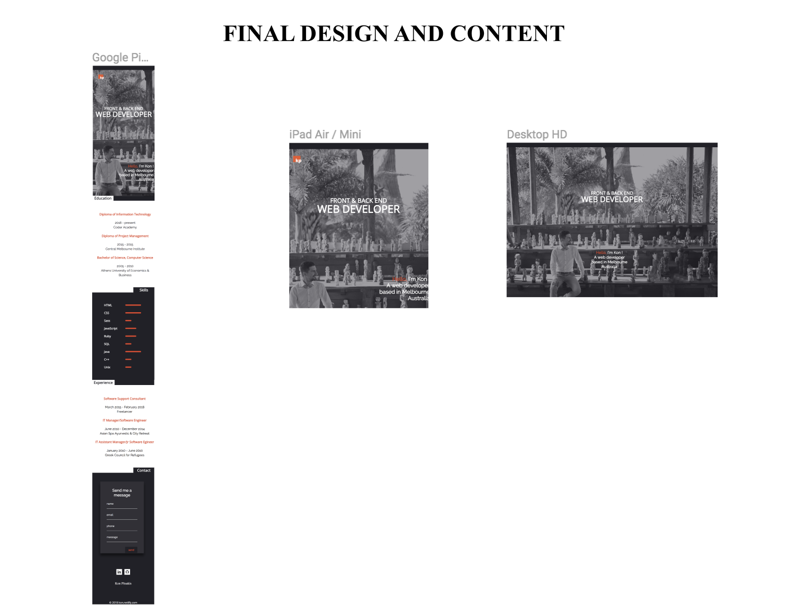

Read Me

[Visit website here](kon.netlify.com)

## Aim
My aim was to create a website that is as simple as possible in order to attract focused attention on  tailored content and future projects.
My sections are as follows:

### Intro
I decided to go with a blurred background and a brief intro on the center of the page. I also chose a  small logo on the top left of the page and used color to make it stand out. 
### Education
This section contains details about my educational background. I tried to keep is as brief as possible. 
### Skills
For this section I chose to provide a graphical representation of my skills. I believe that this way it is faster for employers and recruiters to find the information they are looking for and continue to read on to the next section for more details. 
### Experience
For this section I chose to follow the same structure that was used in the Education section to keep the content consistent and easy to follow. 
### Contact
In this section a user can connect to my Github, LinkedIn,  or send me a message. 

## Design Process
Initially, I designed the basic parts of the website on paper. Then I searched for inspiration online in regards to fonts, colours and images. Lastly, I searched for existing portfolio websites to be inspired.

I decided to create a single page website because I believe that this would give easy access to information without the need to navigate through many pages. This structure gives a clear understanding of content and relates to the form of a CV which is familiar and, therefore, more convenient. 

The chosen colour scheme of this website is pretty simple. The general choice of a dark colour in contrast with white colour leaves enough space to use discretely a stronger colour to emphasise on selected content. I chose a colour between orange and red because it’s a colour that I like and gives that emphasis on some content. All colours inspiration comes from sunsets-mountains-volcanos. 

I struggled with the typography for the logo because my initial idea didn’t match with the website design and I had to go though all google fonts to test it. I changed the initial idea and made a simple logo that I believe is better after all.  It was easy to pick the two main fonts that where more suitable for my design. I chose a combination of Open Sans and Raleway. 

The main design tool that was used was Figma. I experimented on colours, fonts and layouts on a mobile wireframe at first, and iPad - Desktop wireframes at the last stage.
I also used online tools to navigate and assess colour and font choices. 
My Figma project is here: 

[Figma](https://www.figma.com/file/YEgXhjMt8LXZt3EDV6UTgwmt/Personal-Website?node-id=35%3A80)

### Resources used
These are the main tools that I used in the process of making my portfolio website
* Figma
* W3schools
* Codepen
* StackOverflow
* Pintrest

### Challenges
* While designing the skills bars it was hard to align them with the skills descriptions. I  had to improvise and the final result was as expected.
* The logos of Github and Linkedin had to be redesigned to match the the background colour. I reversed the initial black and white and then changed the black to my version of black.
* It was tricky to adjust the contact form to match my figma design
* I had to make a new resized photo as the original did not look good on the mobile version.

### Future Enhancements
* I would like to add a loading feature for the skill bars as an animation
* I would like to add a new section of some nice future projects
* I would like to add a blured box that will appear on hover with some bio paragraph
* I would like to include some parallax effects because they look good but keep the content light at the same time
* I would like to add a menu once the website have more sections

